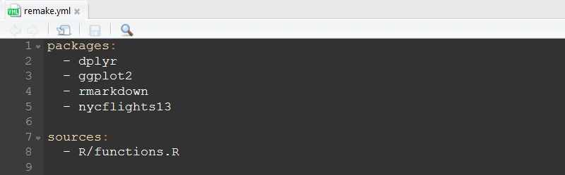
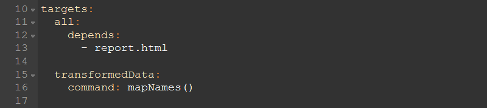
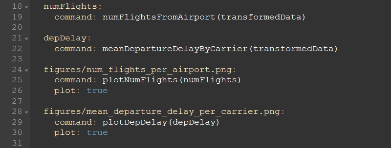
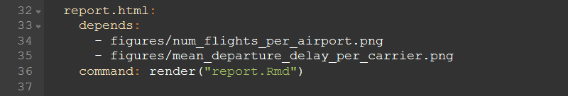
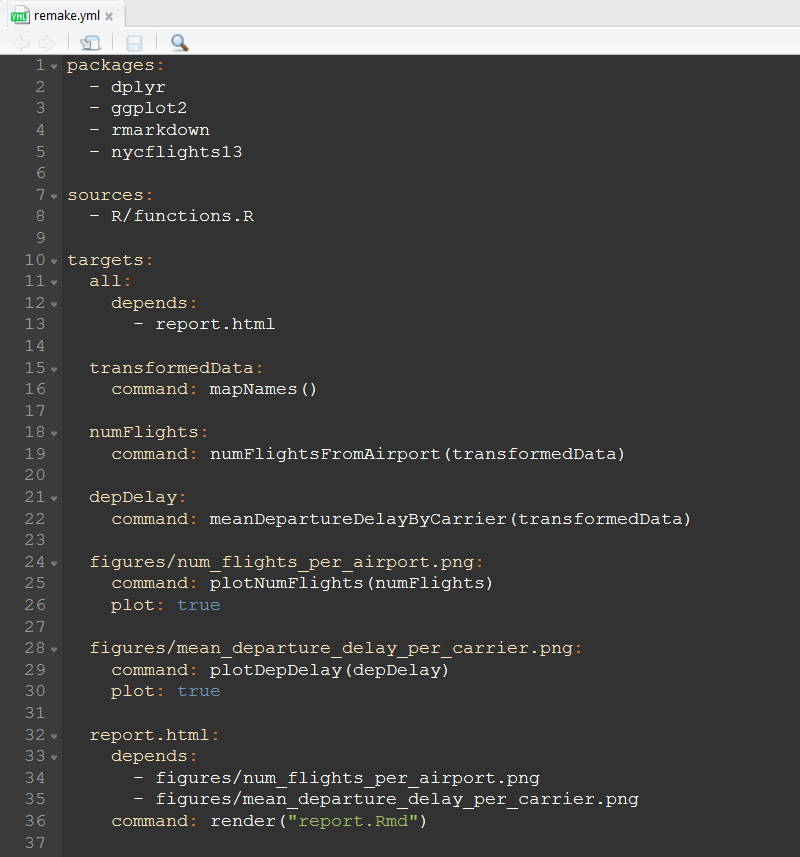

## About Me

* BSc Mathematics and Statistics - Plymouth University
* MSc Statistics - Sheffield University
* Worked as a statistician for C3 Resources and Plymouth University
* Currently work as a R / data science consultant for Mango Solutions

## Agenda

* Reproducible workflows
* Process consistency
* Introducing `remake`

## Single File Analyses

```
|- ProjectName/
    |- data/
    |- output/
    |- run.R
    |- README.md
```

## Multiple Files Analyses

```
|- ProjectName/
    |- data/
    |    |- raw/
    |    |- cleaned/
    |    |- prepared/
    |- output/ 
    |    |- fig/
    |    |- results/
    |- lib
    |    |- source.R
    |    |- explore.R
    |    |- prepare.R
    |    |- model.R
    |    |- evaluate.R
    |    |- utils.R
    |- run.R
    |- README.md
```

## Problems

* Not scalable
* Undocumented dependencies
* Data can change
    * When it does - which parts of the analysis will need re-running?
* Manually re-running analyses is prone to error

## Two Related Problems

* Making research reproducible
    * Recreate outputs from a paper
    * Record entire workflows
* Efficient R based workflows
    * When do we re-run code?

## `remake`

* `remake` is "Make-like build management, reimagined for R"

<ul><li>Written by  [Rich Fitz John](https://github.com/richfitz)</li></ul>

* `remake` allows you to:
    * Change parts of your workflow and only update what changed
    * Make your workflow reproducible since it incorporates the data importing, analysis and reporting in the same pipeline
* **Note:** `remake` is in active development

## `remake` Components

* "Targets": Objects of interest
* "Rules": Functions returning targets
* "Dependencies": Upstream targets

<!--
* "Targets": What are you going to generate. These can be files or R objects.
* "Rules": How are you going to generate your targets. What functions do you need?
* "Dependencies": What do you need to generate your targets. These may be other targets that you need for a particular target. Bear in mind that you might have several intermediate targets to produce your final target.
-->

## `remake` Components - The YAML File

* The yaml file tells `remake` everything that it needs to know.
* It is the "map" of your analysis

## Example

* `nycflights13` (`install.packages("nycflights13")`)
    * contains information about all flights that departed from NYC in 2013
    * 336,776 flights in total
* This example uses the datasets:
    * `flights`, `airports`, `airlines`
* I want to generate a report with
    * The number of flights from each airport each month
    * The mean number of flights per airline each month

## The YAML File - Packages and Source Files

* At the start, write:
    * the packages you need to load
    * the functions you need to source



## The YAML File - the Targets

* Next define the targets
    * The `all` target is the final output



## The YAML File - the Targets

* Now we run the functions on the transformed data and produce the graphics



## The YAML File - the Targets

* Finally, we create the output



##



## Visualising Your Workflow

* `remake` uses the [`DiagrammeR` package](http://rich-iannone.github.io/DiagrammeR/) to visualize your workflows!
* You can diagram your whole pipeline using the `diagram()` function from `remake`.

## Visualising Your Workflow

```{r, echo = FALSE, message = FALSE}
remake::diagram()
```

## Running the Analysis

* Running `remake::make()` will produce the following output:

```
> remake::make()
[  LOAD ] 
[  READ ]                                              |  # loading sources
<  MAKE > all
[ BUILD ] transformedData                              |  transformedData <- mapNames()
[  READ ]                                              |  # loading packages
Joining, by = "carrier"
[ BUILD ] numFlights                                   |  numFlights <- numFlightsFromAirport(transformedData)
[ BUILD ] depDelay                                     |  depDelay <- meanDepartureDelayByCarrier(transformed...
[  PLOT ] figures/num_flights_per_airport.png          |  plotNumFlights(numFlights) # ==> figures/num_flights_per_airport...
[  PLOT ] figures/mean_departure_delay_per_carrier.png |  plotDepDelay(depDelay) # ==> figures/mean_departure_delay_per_ca...
[ BUILD ] report.html                                  |  render("report.Rmd")
...
[ ----- ] all
```

## Re-running the Analysis

```
> remake::make()
<  MAKE > all
[    OK ] transformedData
[    OK ] numFlights
[    OK ] depDelay
[    OK ] figures/num_flights_per_airport.png
[    OK ] figures/mean_departure_delay_per_carrier.png
[    OK ] report.html
[ ----- ] all
```

## Other Essential Tools

* git
* `packrat`
* `testthat`
* `Roxygen2`
* Continuous integration (travis-ci, Jenkins, etc.)
* Code coverage (`covr`)

## Other Automation Tools

* `make`
* `Flowr`
* `Ruigi`
* Many more (<https://github.com/pditommaso/awesome-pipeline>)

## Summary - key messages

* Consistency in your processes
* Consistency in analysis quality
* Reproducibility
* Reusability
* Single and multi-file analyses are not scalable
* They do not track dependencies well
* It can be difficult to know which functions to run and in what order
* `remake` (or similar) can handle these issues for you

## Any Questions?

<p>
   [https://nathaneastwood.github.io](https://nathaneastwood.github.io)
</p>
<p>
   [\@nathaneastwood_](https://www.twitter.com/nathaneastwood_)
</p>
<p>
   [https://github.com/nathaneastwood](https://github.com/nathaneastwood)
</p>
