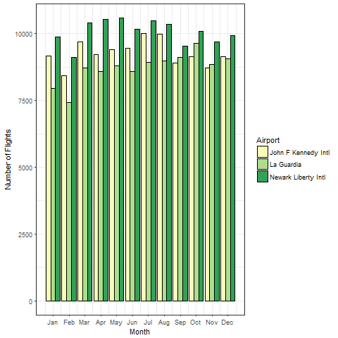
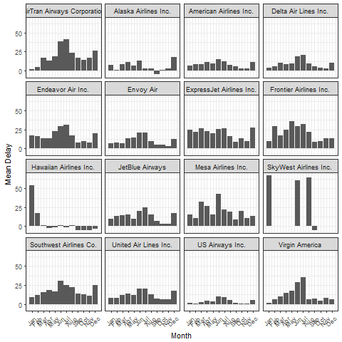

```{r setup, include=FALSE}
knitr::opts_chunk$set(echo = TRUE)
```

## Report on the number of flights from NYC in 2013

### How many flights leave each airport in each month?

Import the figure generated by the `plotNumFlights` function in R/function.R  
*If there was a change in the data, the `plotNumFlights` function will be rerun
to generate the correct figure.*



### What is the mean departure delay per carrier in each month?

Import the figure generated by the `plotDepDelay` function in R/function.R  
*If there was a change in the data, the `plotDepDelay` function will be rerun
to generate the correct figure.*


